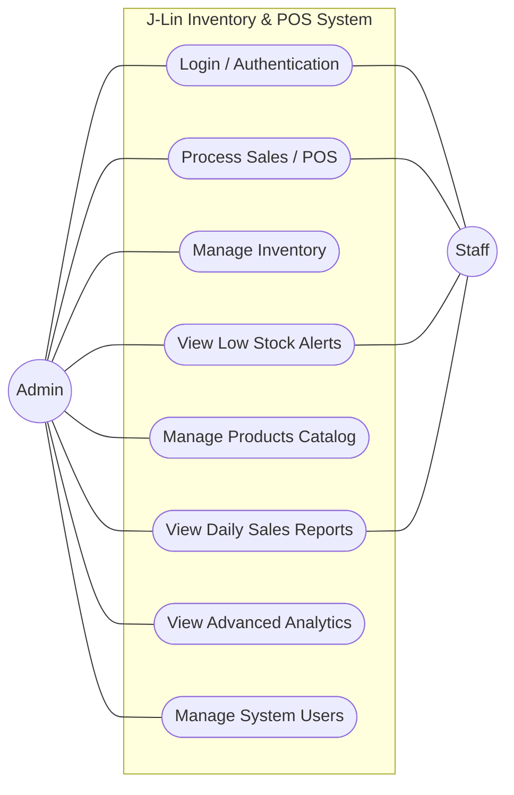

# System Use Case Diagram

This use case diagram outlines the primary interactions between the system's users (Admin and Staff) and the core features of the J-Lin Inventory and POS System.

### Roles and Permissions

- **Staff (Cashier/Clerk):** Handles day-to-day operations. They can process sales (which automatically updates stock), check low stock alerts, and review basic daily sales reports. They do NOT have direct access to manually adjust inventory levels.
- **Admin (Manager/Owner):** Has elevated privileges. In addition to all staff capabilities, admins can manage the product catalog (add/edit/delete), manually manage inventory (stock-in/stock-out), access advanced analytics (profit margins, best sellers), and control user accounts.
